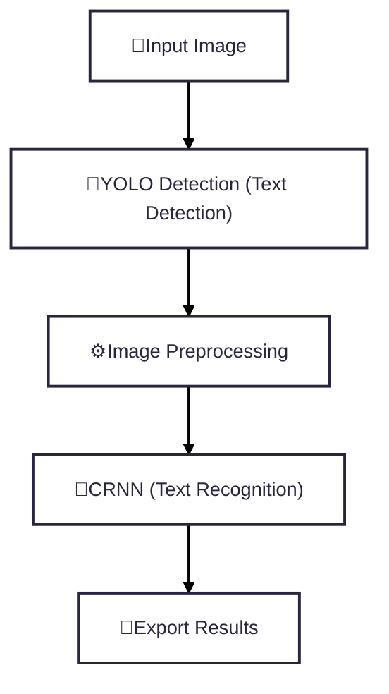

# STR-full-pipeline
# 🚀 STR Pipeline (YOLO + RCNN)
**Authors:**
- Lê Nguyễn Gia Phúc
  
**Date:** 2025-09-09

This system combines **YOLOv11** (detection), **CRNN(Convolutional Recurrent Neural Network) Model** (recognition). This README gives an overview of the project structure.
___
## 🌟 Overview
**STR (Scene Text Recognition)** is an AI application that automatically detects and recognizes text from natural scene images. The system leverages a combination of mordern deep learning models to ensure robust detection and recognition across various fonts, colors and backgrounds.

The pipeline consists of:

- 🎯 **YOLOv11 (Text Detection):** Detects and crops text regions from the input image.  
- 🤖 **CRNN (Text Recognition):** Recognizes text sequences from the detected regions.  
- 🧮 **CTC Loss (Connectionist Temporal Classification):**  Applied to align predicted character sequences from the CRNN model with the target text labels, making it suitable for sequence recognition tasks where the alignment between input and output is unknown.
___
## ⚡ Quick Start

### 1) Environment Setup
```bash
python 3.13.1 -m venv venv
pip install -r requirements.txt
```
### 💻 System Requirements
- **Python:** 3.13.1 (tested and recommended)  
- **Operating System:** Windows 10/11 (64-bit)  
- **GPU (optional):** NVIDIA GPU with CUDA/cuDNN for acceleration (otherwise runs on CPU)  
- **RAM:** ≥ 8GB recommended for smooth processing

### ▶️ Run the App
- 📘 **Training:** Run `Detect_Reg_Training.ipynb` to retrain the model with different seeds.  
- 📗 **Inference:** Run `STR_full_pipeline.ipynb` for text detection and recognition inference.
___
## 🔎 Overall Pipeline

___
## 📂 Project Structure
```bash
STR-full-pipeline/
│── 📂 weight/                  # Pretrained models (YOLO + CRNN)
│   │── text_detect.pt          # YOLOv11 detection model
│   │── text_reg.pt             # CRNN recognition model
│── 📄 Detect_Reg_Training.ipynb # Notebook for retraining 
│── 📄 STR_full_pipeline.ipynb   # Notebook for full STR inference
│── 📄 requirements.txt          # Project dependencies
│── 📄 README.md                 # Project documentation
│── 📄 .gitattributes            # Git configuration file
